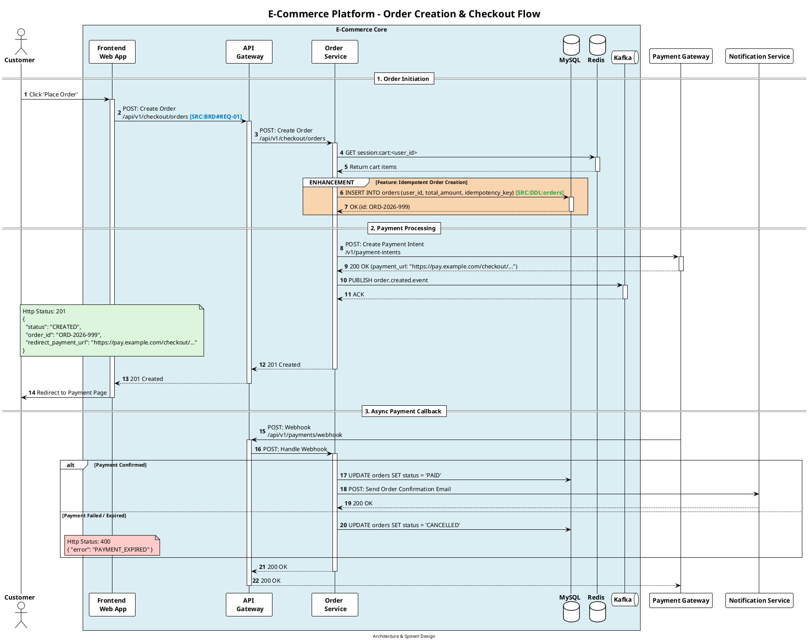

# 📐 Universal PlantUML Sequence Diagram Standards

This specification defines universal rules for authoring, validating, and generating production-ready, readable, and consistent **PlantUML sequence diagrams (`.puml`)** across any software architecture (Microservices, Monolithic, Event-Driven, or Cloud-Native).

All sequence diagrams generated by `/brain-deliver` MUST adhere to these conventions.

---

## 📑 Core Visual & Structural Rules

### 1. Mandatory Header & Styling
Every `.puml` file MUST start with the standard clean theme, SansSerif font styling, and unlinked participant hiding:

```plantuml
@startuml [diagram-slug]
autonumber

title [SYSTEM / MODULE] - [FEATURE / FLOW NAME]

footer Architecture & System Design
skinparam minClassWidth 90
!theme plain
hide unlinked
```

---

### 2. Layout & System Partitioning: Box Boundary (`#DBEEF3`)
To maintain immediate clarity between internal application boundaries and external dependencies:

- **Internal Services & Storage**: Enclosed inside a single `box "[System / Service Name]" #DBEEF3`.
- **Participants**: Written in bold with multi-line roles (`participant "**Frontend** \n **Web / Mobile**" as f`).
- **External Surrounding Systems**: Placed **outside** the box boundary (e.g. Payment Gateways, Third-Party Providers, External Upstream/Downstream APIs).

```plantuml
actor "**User**" as u

box "Core Platform" #DBEEF3
    participant "**Frontend** \n **Client**" as f
    participant "**API** \n **Gateway**" as gw
    participant "**Order** \n **Service**" as ord
    database "**Database**" as db
    database "**Cache**" as cache
    queue "**Message** \n **Broker**" as mq
end box

' External Surrounding Systems (Outside System Boundary)
participant "**Payment Gateway**" as pay
participant "**Notification Provider**" as notif
```

---

### 3. API Invocation & Arrow Conventions
- **Request Format**: `Caller -> Receiver: METHOD: Action Title \n/url/endpoint` (or `RPC: MethodName` for gRPC).
- **Lifelines**: Explicitly manage lifelines with `activate` and `deactivate`.
- **Inline Provenance**: Embed source citations directly onto requests/responses: `<color:#007acc><b>[SRC:BRD#REQ-01]</b></color>` or `<color:#28a745><b>[SRC:DDL:table_name]</b></color>`.

```plantuml
f -> gw: POST: Submit Order \n/api/v1/orders <color:#007acc><b>[SRC:BRD#REQ-01]</b></color>
activate gw
gw -> ord: POST: Create Order \n/api/v1/orders
activate ord

ord -> db: INSERT INTO orders <color:#28a745><b>[SRC:DDL:orders]</b></color>
activate db
db --> ord: OK (order_id: ORD-1001)
deactivate db

ord --> gw: 201 Created
deactivate ord
gw --> f: 201 Created
deactivate gw
```

---

### 4. Response Note Block (`#DDF4DD`) & Error Note Block (`#FFCCCC`)
- **Success Response (200 / 201)**: Place a light green note block (`#DDF4DD`) over the calling frontend/client lifeline with the representative response JSON payload.
- **Error Response (4xx / 5xx)**: Place a light red note block (`#FFCCCC`) with the error status code and error payload.

```plantuml
note over f #DDF4DD
    Http Status: 200
    {
      "status": "SUCCESS",
      "data": {
        "order_id": "ORD-1001",
        "status": "PENDING_PAYMENT"
      }
    }
end note
```

---

### 5. Feature Enhancement & Branching Blocks (`#F8D4AF` / `#transparent`)
- **Enhancement / Sprint Changes**: Wrap new or modified logic in a peach-colored group:
  ```plantuml
  group #F8D4AF ENHANCEMENT [Sprint 24: Real-time Stock Lock]
      ord -> cache: SETNX lock:inventory:item_123 (TTL: 30s)
      activate cache
      cache --> ord: OK (Lock Acquired)
      deactivate cache
  end
  ```
- **Conditional / Alternative Branches**: Use transparent backgrounds for readability:
  ```plantuml
  alt #transparent Payment Successful
      pay --> ord: Webhook (Status: PAID)
  else Payment Declined / Timeout
      pay --> ord: Webhook (Status: FAILED)
      note over f #FFCCCC
          Http Status: 402
          { "error": "PAYMENT_FAILED", "message": "Card declined" }
      end note
  end
  ```

---

## 📋 Complete Universal Template Example


