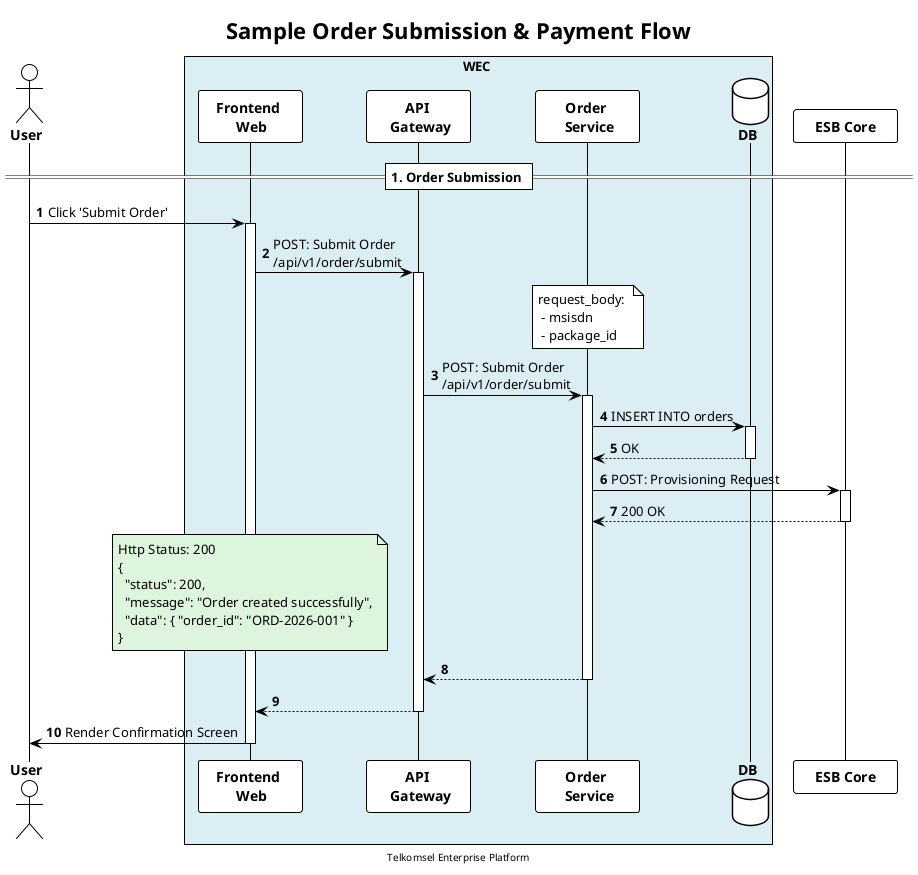

# 📐 PlantUML Sequence Diagram Standards (Telkomsel WEC Blueprint)

Skill ini mengatur aturan baku pembuatan, pembaruan, dan standardisasi diagram sequence PlantUML (`.puml`) di seluruh vault Second Brain. Seluruh diagram **WAJIB MENGIKUTI STRUKTUR DAN KONVENSI VISUAL RESMI WEC FMC**.

---

## 📑 Aturan Baku Styling (WEC Blueprint)

### 1. Struktur Header Wajib
Setiap file `.puml` WAJIB diawali dengan:
```plantuml
@startuml [diagram_kebab_slug]
autonumber

title [NAMA FITUR / MODUL] - [NAMA ALUR / FLOW]

footer [Nama Proyek / Service Tag]
skinparam minClassWidth 90
!theme plain
hide unlinked
```

---

### 2. Layout Actor, Box Internal (`#DBEEF3`), & Participant
- Gunakan teks tebal `**...**` dan pemisah baris `\n` untuk seluruh participant.
- Seluruh komponen internal sistem wajib dibungkus dalam `box WEC #DBEEF3`:

```plantuml
actor "**User**" as u

box WEC #DBEEF3
    participant "**Frontend** \n **Web**" as f
    participant "**API** \n **Gateway**" as a
    participant "**Order** \n **Service**" as o
    database "**DB**" as db
    database "**Redis**" as r
    queue "**RabbitMQ**" as rb
end box

participant "**ESB**" as e
participant "**Docman**" as doc
participant "**Isyana**" as isy
```

---

### 3. Format Pemanggilan API & Arrow
- Gunakan format `METHOD: Title \n/url/endpoint`:
- Sertakan eksplisit `activate` dan `deactivate` pada lifelines:

```plantuml
f -> a: GET: Package Details \n/v1/packages/detail
activate a
a -> o: GET: Package Details \n/v1/packages/detail
activate o

note over o
request_body:
 - package_id
 - msisdn
end note

o -> db: Query package metadata
activate db
db --> o: Return package record
deactivate db

o --> a:
deactivate o
a --> f:
deactivate a
```

---

### 4. Format Response Note Block (`#DDF4DD`)
- Response status code dan payload representatif diletakkan di atas lifeline frontend dengan warna hijau muda `#DDF4DD`:

```plantuml
note over f #DDF4DD
    Http Status: 200
    {
      "status": 200,
      "message": "Success",
      "data": { ... }
    }
end note
```

---

### 5. Format Group Enhancement / Alternatif (`#F8D4AF` / `#transparent`)
- Untuk blok alternatif atau error handling:

```plantuml
alt #transparent Success Case
    e --> o: 200 OK (Eligible)
else Ineligible / Error
    e --> o: 4xx / 5xx
    note over f #FFCCCC
        Http Status: 400
        { "error": "INSUFFICIENT_BALANCE" }
    end note
end
```

- Untuk blok enhancement sprint:

```plantuml
group #F8D4AF ENHANCEMENT [Sprint XX: Feature Name]
    f -> a: POST: Enhanced Action \n/v1/action/enhanced
    ...
end group
```

---

## 📋 Contoh Lengkap Template Resmi (.puml)


